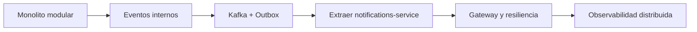

# Microservicios con Java y Spring Boot actuales

> **Estado curricular:** guía avanzada para `SESIONES/Semana13` a `Semana15`. Se estudia después del monolito modular, Kafka, outbox, Docker y observabilidad.

## Objetivos

- Distinguir microservicio, monolito modular y monolito distribuido.
- Extraer una capacidad por razones de negocio u operación, no por entidad.
- Diseñar datos, contratos, seguridad, resiliencia y observabilidad distribuidos.
- Ejecutar todo localmente con Docker Compose y herramientas gratuitas.

## Cuándo usar microservicios

Se justifican cuando un límite de negocio es estable y necesita autonomía de despliegue, escalado, disponibilidad o equipo. No se justifican porque una aplicación tenga muchas tablas o porque “sea arquitectura moderna”.

Costos inevitables:

- latencia y fallos de red;
- consistencia eventual;
- contratos y compatibilidad;
- observabilidad distribuida;
- más pipelines, imágenes, configuración y parches;
- pruebas y operación más complejas.

## Evolución recomendada



Riwi Learning Platform extrae primero notificaciones: tolera consistencia eventual, consume eventos y puede fallar sin deshacer una inscripción ya confirmada.

## Servicios educativos

```text
learning-platform-api/       # rutas, módulos, inscripciones
notifications-service/      # consume EnrollmentCreated
api-gateway/                 # borde HTTP, solo en etapa posterior
```

Cada servicio Spring tiene su propio Wrapper, `pom.xml`, imagen, configuración, tests y ownership de datos. No se comparte un paquete de entidades JPA.

## Contrato de evento

```java
public record EnrollmentCreatedV1(
    UUID eventId,
    Instant occurredAt,
    UUID enrollmentId,
    UUID coderId,
    UUID learningRouteId
) {}
```

El contrato no expone entidades ni información innecesaria. La clave Kafka es `enrollmentId`; el consumidor registra `eventId` antes de producir efectos para ser idempotente.

## Consumidor Spring Kafka

```java
@Component
final class EnrollmentCreatedListener {
    private final NotifyEnrollmentUseCase useCase;

    EnrollmentCreatedListener(NotifyEnrollmentUseCase useCase) {
        this.useCase = useCase;
    }

    @KafkaListener(topics = "learning.enrollment-created.v1")
    void on(EnrollmentCreatedV1 event) {
        useCase.notifyOnce(event);
    }
}
```

Retry y dead-letter topic se configuran explícitamente. Un mensaje inválido no debe bloquear indefinidamente la partición.

## Comunicación HTTP

Para código imperativo nuevo se usa `RestClient`; `WebClient` se reserva para un flujo reactivo justificado.

```java
@Configuration
class HttpClientsConfig {
    @Bean
    RestClient progressClient(RestClient.Builder builder,
                              @Value("${clients.progress.base-url}") String baseUrl) {
        return builder.baseUrl(baseUrl).build();
    }
}
```

Toda llamada remota requiere timeout. Retry solo aplica a errores transitorios y operaciones idempotentes. Circuit breaker evita insistir sobre una dependencia degradada; no repara el servicio.

## Datos y consistencia

- Base de datos por servicio, aunque Compose ejecute un solo servidor PostgreSQL con bases separadas para el laboratorio.
- No hacer joins entre bases de servicios.
- Publicar eventos con transactional outbox.
- Modelar compensaciones cuando una operación abarque capacidades distintas.
- Mantener vistas locales/materializadas para consultas que no deben hacer fan-out.

## Descubrimiento y configuración

En Docker Compose, los nombres de servicio proporcionan DNS. Variables de entorno y archivos de configuración bastan para el laboratorio. Eureka y Config Server se comparan cuando existe una necesidad real de registro dinámico o configuración centralizada; no son obligatorios.

Si se usa Spring Cloud con Boot 4.1.x, importar el BOM Spring Cloud 2025.1.x. Nunca fijar individualmente versiones de Gateway, Config y Eureka.

## Gateway

Responsabilidades apropiadas:

- terminación TLS en un entorno real;
- autenticación inicial y propagación segura de identidad;
- routing, CORS, rate limiting y observabilidad de borde.

No debe contener reglas de inscripción, composición compleja ni acceso a bases de datos. Cada servicio vuelve a autorizar el recurso que protege.

## Observabilidad

Cada servicio expone su propio health y métricas internas. Prometheus raspa targets por servicio/instancia; el Gateway no reemplaza esta visibilidad. Propagar correlation/trace context tanto en HTTP como en metadatos de eventos.

Métricas mínimas:

- latencia y errores HTTP;
- pools de conexiones;
- consumer lag y DLT;
- profundidad/edad del outbox;
- circuit breaker y timeouts;
- métricas de negocio sin tags de alta cardinalidad.

## Pruebas

1. Unitarias de dominio/casos de uso.
2. Integración de adaptadores con PostgreSQL/Kafka Testcontainers.
3. Contratos HTTP y eventos.
4. End-to-end pequeño para caminos críticos.
5. Pruebas de degradación: latencia, caída, duplicado y recuperación.

No construir una suite E2E gigante que deba arrancar toda la organización para dar feedback.

## Infraestructura local

```bash
# Crea compose.yml siguiendo COMPLEMENTOS/README_Infraestructura_Local.md
docker compose config
docker compose up -d
```

Los proyectos del estudiante pueden añadirse a un Compose propio y conectarse a la misma red. Kafka se anuncia como `kafka:29092` entre contenedores y `localhost:9092` desde el host.

## Antipatrones

- servicio por tabla;
- base de datos o entidades compartidas;
- cadenas síncronas largas;
- retry sin timeout/idempotencia;
- usar Kafka como RPC;
- confiar toda autorización al Gateway;
- desplegar juntos servicios supuestamente independientes;
- copiar librerías comunes con dominio mutable.

## Laboratorio obligatorio

1. Escribir ADR de extracción de notificaciones.
2. Crear `notifications-service` Java/Spring.
3. Consumir `EnrollmentCreatedV1` idempotentemente.
4. Probar mensaje duplicado y caída temporal de Kafka/servicio.
5. Mostrar métricas y logs correlacionados.
6. Defender por qué el resto continúa en el monolito.

## Preguntas de entrevista

- ¿Qué es un monolito distribuido?
- ¿Por qué base de datos por servicio?
- ¿Qué diferencia retry, circuit breaker y bulkhead?
- ¿Cómo evolucionar un contrato de evento?
- ¿Cuándo conservarías un monolito modular?

## Recursos oficiales

- [Spring Cloud](https://spring.io/projects/spring-cloud/)
- [Spring Cloud Gateway](https://docs.spring.io/spring-cloud-gateway/reference/)
- [Spring for Apache Kafka](https://docs.spring.io/spring-kafka/reference/)
- [Spring Modulith](https://docs.spring.io/spring-modulith/reference/)
