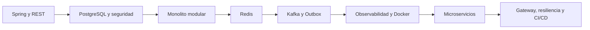

# Ruta avanzada Java y Spring Boot

Ruta de aprendizaje progresiva para desarrollar backend profesional con Java y el ecosistema Spring. La estructura original se conserva:

- `SESIONES`: aprendizaje semana a semana de Java/Spring y sus integraciones.
- `COMPLEMENTOS`: fundamentos de tecnologías externas o lecturas transversales.
- `PRACTICA`: actividades integradoras.

El caso conductor es **Riwi Learning Platform**, una plataforma de usuarios, coders, trainers, rutas, módulos, inscripciones, actividades, entregas, evaluaciones, progreso, notificaciones y reportes.

## Compatibilidad

- Java 17 es la base mínima de compilación.
- Java 21 es el runtime recomendado.
- Spring Boot 4.1.x es la línea de referencia actual.
- Spring Cloud 2025.1.x se incorpora únicamente en la etapa de microservicios.
- Se usa Jakarta; no se introducen APIs `javax.*` antiguas de Java EE.

Consulta [Java 17 y Java 21](COMPLEMENTOS/README_Java_17_21.md).

## Ruta por semanas

| Semana | Tema | Resultado |
| ---: | --- | --- |
| [1](SESIONES/Semana1/) | Java 17/21, Spring Core, IoC, DI, SOLID y perfiles | Proyecto base reproducible y desacoplado |
| [2](SESIONES/Semana2/) | Spring Boot, REST, validación, RFC 9457 y OpenAPI | API HTTP profesional con contrato probado |
| [3](SESIONES/Semana3/) | Spring Data JPA, PostgreSQL y transacciones | Persistencia con Flyway y Testcontainers |
| [4](SESIONES/Semana4/) | Monolito modular, arquitectura pragmática y testing | Límites claros y calidad automatizada |
| [5](SESIONES/Semana5/) | Spring Security, JWT y Docker | API protegida y entrega reproducible |
| [6](SESIONES/Semana6/) | Redis, Kafka, outbox y observabilidad | Cierre profesional del módulo de seis semanas |
| [7](SESIONES/Semana7/) | RabbitMQ comparativo, Redis y observabilidad | Refuerzo y transición a profundización |
| [8](SESIONES/Semana8/) | Spring Cache + Spring Data Redis | Caché con TTL, invalidación y métricas |
| [9](SESIONES/Semana9/) | Spring for Apache Kafka | Productores, consumidores, DLT e idempotencia |
| [10](SESIONES/Semana10/) | Consistencia y transactional outbox | Publicación confiable PostgreSQL–Kafka |
| [11](SESIONES/Semana11/) | Actuator, Micrometer, Prometheus y Grafana | Diagnóstico local end-to-end |
| [12](SESIONES/Semana12/) | Docker y Docker Compose | Entorno reproducible y seguro |
| [13](SESIONES/Semana13/) | De monolito modular a microservicios | Extracción razonada de notificaciones |
| [14](SESIONES/Semana14/) | Gateway, RestClient, resiliencia y contratos | Integración distribuida tolerante a fallos |
| [15](SESIONES/Semana15/) | Seguridad y observabilidad distribuidas | Identidad, tracing y operación |
| [16](SESIONES/Semana16/) | CI/CD y cierre | Matriz Java 17/21 e imagen trazable |

## Alcance del módulo Riwi de seis semanas

Las Semanas 1–6 forman un recorrido cerrado. Al terminarlas, el estudiante entrega un monolito modular con REST, PostgreSQL/Flyway, Security/JWT, pruebas, Docker, Redis, Kafka, outbox y observabilidad básica. Las Semanas 7–16 no son prerrequisito para aprobar el módulo: funcionan como refuerzo y ruta avanzada hacia microservicios.

No se afirma que seis semanas basten para dominar sistemas distribuidos. El núcleo enseña las decisiones y deja la aplicación preparada; la extracción de servicios, Gateway, resiliencia, tracing y CI/CD avanzado continúan después.

## Guías complementarias

### Plataforma y entorno

- [Java 17 y Java 21](COMPLEMENTOS/README_Java_17_21.md)
- [Entorno de desarrollo](COMPLEMENTOS/README_Entorno_Desarrollo.md)
- [Spring Initializr y Maven Wrapper](COMPLEMENTOS/README_Spring_Initializr.md)
- [Dockerfile](COMPLEMENTOS/README_DockerFile.md)
- [Infraestructura local gratuita](COMPLEMENTOS/README_Infraestructura_Local.md)

### Datos, caché y mensajería

- [PostgreSQL](COMPLEMENTOS/README_PostgreSQL.md)
- [Redis y Valkey](COMPLEMENTOS/README_Redis_Valkey.md)
- [Apache Kafka](COMPLEMENTOS/README_Apache_Kafka.md)
- [Validación y paginación](COMPLEMENTOS/README_Validacion_Paginacion.md)

### Diseño y ecosistema Spring

- [Principios SOLID](COMPLEMENTOS/README_Principios_Solid.md)
- [Arquitecturas limpias](COMPLEMENTOS/README_Arquitecturas_Limpias.md)
- [Respuestas de API](COMPLEMENTOS/README_Api_Responses.md)
- [Librerías Spring Boot](COMPLEMENTOS/README_Librerias_Springboot.md)
- [Microservicios Java/Spring](COMPLEMENTOS/README_Microservicios.md)
- [Servicios web](COMPLEMENTOS/README_Servicios_WEB.md)
- [Thymeleaf opcional](COMPLEMENTOS/README_Thymeleaf.md)
- [Monitoreo](COMPLEMENTOS/README_Monitoreo.md)

## Progresión arquitectónica

La ruta no comienza con microservicios. Primero se construyen reglas, pruebas y límites modulares; después se distribuye únicamente una capacidad justificada.

## Infraestructura

Todo se ejecuta gratuitamente en local:

- PostgreSQL;
- Redis o Valkey;
- Apache Kafka en KRaft, sin ZooKeeper;
- Prometheus y Grafana OSS;
- aplicaciones Spring Boot mediante Docker Compose.

No se requiere AWS, LocalStack, Kubernetes, servicios cloud ni licencias pagas. Esas tecnologías pueden estudiarse después como extensiones.

## Forma de trabajo

Cada estudiante mantiene su proyecto incremental y debe:

1. usar Maven Wrapper;
2. ejecutar `./mvnw clean verify`;
3. validar con Java 17 y 21;
4. implementar reglas de negocio, no CRUD sin contexto;
5. escribir pruebas y migraciones;
6. documentar ventajas, alternativas y costos de cada patrón;
7. no subir secretos.

## Prácticas integradoras del núcleo

- [Semana 4 — Monolito modular](PRACTICA/PRACTICA_S4.md)
- [Semana 5 — Seguridad y Docker](PRACTICA/PRACTICA_S5.md)
- [Semana 6 — Redis, Kafka y outbox](PRACTICA/PRACTICA_S6.md)
- Los archivos `REFUERZO_*` conservan los laboratorios extensos anteriores de REST, validación, testing y OpenAPI.

## Definición de terminado

Una semana está completa cuando el laboratorio puede ejecutarse desde cero, las pruebas pasan, las decisiones pueden defenderse y las evidencias indicadas están documentadas. Cobertura alta sin buenos escenarios no se considera calidad.
